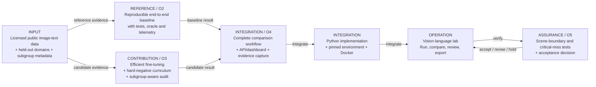
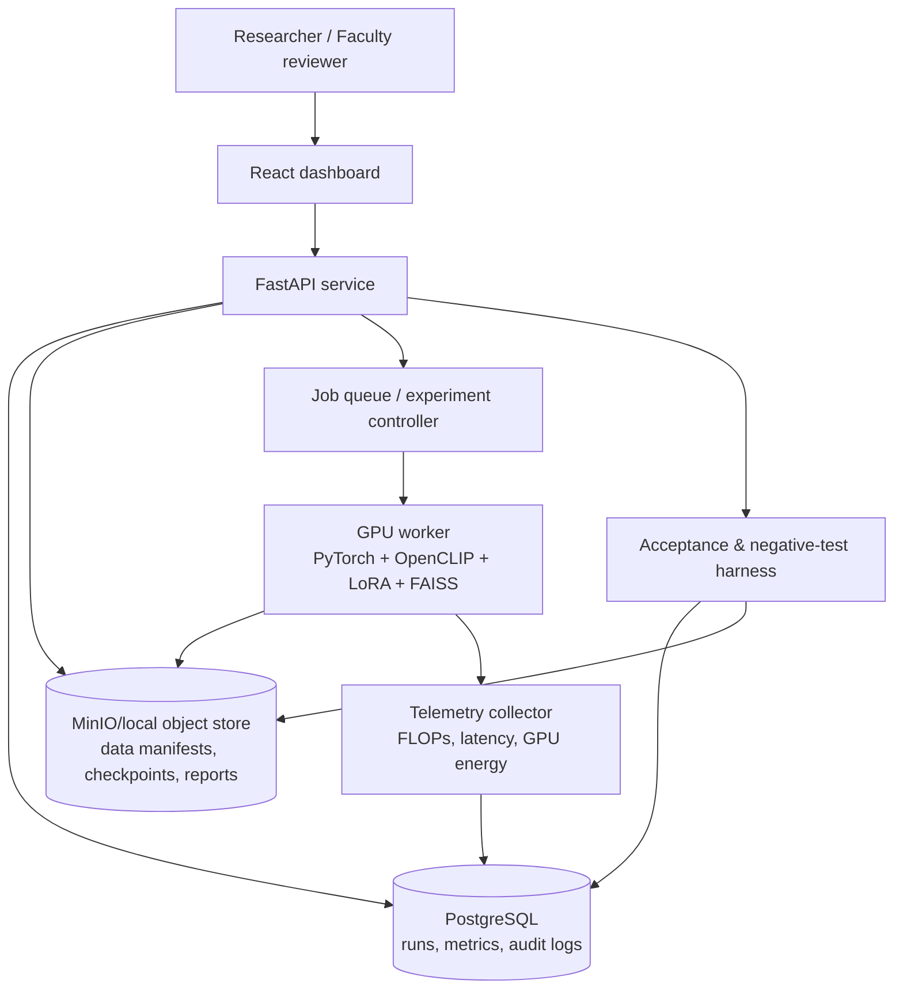

# KLCAP-2026-00167: Required System Architecture Plan

## What the portal diagram means

You must build one integrated **Python-based Vision-Language Representation Lab**. It is not enough to make a notebook, train one model, or create a dashboard. The completed system must compare:

- a reproducible **reference/baseline** (O2), and
- your **efficient fine-tuning + hard-negative + subgroup-audit contribution** (O3),

using identical, licensed image-text evidence. It must then integrate, operate and verify the comparison with scene-boundary and critical-miss tests.



## What to build in each box

| Portal box | Build this | Evidence you must keep |
|---|---|---|
| **Input** | Dataset ingestion, licence/provenance manifest, validation checks, frozen train/validation/test/acceptance splits | Dataset URLs, licences, hashes, sample IDs, subgroup/domain metadata, split-leakage report |
| **Reference** | A pinned OpenCLIP/CLIP-style baseline that makes image and text embeddings, ranks retrieval results, supports linear probes and logs compute | Docker image, `baseline.yaml`, seed, source commit, unit tests, baseline metrics and telemetry |
| **Contribution** | Parameter-efficient fine-tuning (LoRA/adapters), hard-negative sampler and fairness/robustness evaluator | Candidate config, ablations, comparison table, error cases and resource profile |
| **Integration** | One workflow connecting data, runs, model artifacts, metrics, reports and reviewer interface | API contracts, PostgreSQL records, artifact paths, end-to-end test |
| **Python** | The executable project package and reproducible command-line workflows | `requirements.lock`, Dockerfile, scripts, test report and runbook |
| **Operation** | A simple web interface/API for launching approved runs and viewing results | Demo video, operator guide, health/quality indicators and run logs |
| **Assurance** | Independent acceptance harness, critical-case tests, safe abstention and recovery logs | Acceptance report, negative-test fixtures, observed vs expected results, recovery evidence |

## Recommended physical deployment



### Minimum stack

- **Python 3.11**, PyTorch, OpenCLIP or Hugging Face Transformers, PEFT/LoRA, FAISS.
- **FastAPI** for the backend and **React** only for a small reviewer dashboard.
- **PostgreSQL** for experiment metadata and metric/slice results.
- **MinIO** (or a controlled local folder during CP1) for large artifacts/checkpoints.
- **Docker Compose** to run the API, database, object store and worker reproducibly.
- PyTorch profiler + NVML/CodeCarbon for FLOPs, runtime and energy telemetry.

Do not start with Kubernetes, a large public web app, or distributed training. A Dockerized lab system is sufficient and much more achievable.

## Required workflow

### 1. Freeze evidence before model work

Create `dataset_manifest.json` with source, licence, access date, sample hash, domain, subgroup fields and split. Split by the correct independent unit (for example source/domain), not random image rows, so near-duplicates or the same scene cannot leak into acceptance.

```text
data ingest → quality checks → immutable split manifests
                         ├─ train / validation: model development
                         └─ acceptance: read-only, never used for tuning
```

### 2. Build O2 baseline

Use a pre-trained vision-language encoder without changing it, or use a clearly documented baseline fine-tuning regime. For each run, save:

- model and preprocessing version;
- dataset manifest ID; seed; config hash; git commit; Docker image digest;
- Recall@K, linear-probe accuracy, robustness results and subgroup slices;
- training FLOPs, elapsed time, GPU energy and energy/query;
- failure examples—not only averages.

The O2 result becomes the frozen comparison point for O3.

### 3. Build the O3 contribution

Implement these three parts as separate, testable Python modules:

1. **Efficient fine-tuning:** LoRA/adapters with a fixed trainable-parameter and compute budget.
2. **Hard-negative curriculum:** start with easy negatives, then add semantically close but incorrect image-text pairs; log exactly which negatives were used.
3. **Subgroup-aware audit:** automatically compute every metric by approved dataset subgroup and domain; flag unacceptable gaps.

Run ablations to show which part causes the improvement:

```text
O2 baseline
O3a = baseline + LoRA
O3b = O3a + hard negatives
O3c = O3b + subgroup-aware selection/audit
```

Every method must use the same approved data and compute envelope.

### 4. Integrate into the lab application

The backend owns access to data and artifacts. The dashboard only presents results.

| API capability | Minimum endpoint/example |
|---|---|
| Dataset validation | `POST /datasets/validate` |
| Create/run experiment | `POST /experiments`, `POST /experiments/{id}/run` |
| Compare O2 and O3 | `GET /comparisons/{baseline_id}/{candidate_id}` |
| View subgroup audit | `GET /evaluations/{id}/slices` |
| Run acceptance test | `POST /acceptance/{id}/run` |
| Export evidence | `GET /reports/{id}` |

## Acceptance gates

| Gate | Pass condition |
|---|---|
| Data gate | Valid licence/provenance, quality checks pass and acceptance split is frozen |
| Reproducibility gate | A clean machine rebuilds O2 from pinned code/config/environment |
| Fair-comparison gate | Baseline and candidate have identical evidence, evaluator and resource envelope |
| Quality gate | Retrieval recall and linear-probe results meet target or stay within the approved non-inferiority margin while resource cost improves ≥20% |
| Fairness gate | No critical subgroup is hidden by aggregate results; disparity is reported and reaches the approved threshold |
| Operations gate | Logs, metrics, model/config checks and exportable evidence exist |
| Assurance gate | Boundary, critical-miss and injected failure tests cause a clear `HOLD`/abstain response and have documented recovery |

## Negative tests you must demonstrate

1. **Unequal data/compute:** Candidate uses a changed manifest or exceeds its budget → system blocks comparison.
2. **Split leakage:** A duplicate/related scene occurs in development and acceptance data → validation fails.
3. **Out-of-envelope input:** Query comes from an unapproved domain or lacks required metadata → labelled abstention, not a confident retrieval claim.
4. **Critical subgroup regression:** Overall recall improves but a rare/critical slice degrades → acceptance result is `REVISE`.
5. **Artifact mismatch:** Checkpoint and preprocessing/config hashes do not match → inference/evaluation is refused.
6. **Telemetry unavailable:** FLOPs or energy measurement is missing → no resource-improvement claim is allowed.

## Repository layout

```text
klcap-00167/
├── apps/api/                   # FastAPI, auth, report endpoints
├── apps/web/                   # reviewer dashboard
├── src/data/                   # ingest, manifests, checks and splits
├── src/models/                 # baseline, LoRA, hard-negative modules
├── src/evaluation/             # retrieval, probes, robustness, fairness
├── src/telemetry/              # FLOPs, energy, latency measurement
├── src/acceptance/             # gate and negative-test harness
├── configs/                    # versioned YAML configs
├── tests/                      # unit, integration and leakage tests
├── evidence/                   # manifests and small fixtures, never full raw data
├── docs/                       # ADRs, runbook and project reports
├── docker-compose.yml
└── README.md
```

## Semester-by-semester build plan

| Stage | Work | Demonstrable output |
|---|---|---|
| CP1 weeks 1–3 | Choose dataset, confirm licence and stakeholder/reproduction evidence; freeze requirements/KPIs | Charter, source-to-claim map, data manifest, system diagram |
| CP1 weeks 4–7 | Implement dataset validation/splitting and O2 baseline | Reproducible baseline command, unit tests and first metrics |
| CP1 weeks 8–12 | Add artifact registry, telemetry and first dashboard/API slice | One end-to-end run visible to reviewer with baseline evidence |
| CP2 weeks 1–4 | Implement LoRA + hard-negative curriculum and ablations | Candidate comparison and resource profile |
| CP2 weeks 5–8 | Implement subgroup/robustness audit and safety guard | Slice dashboard, failure catalogue and `HOLD` behaviour |
| CP2 weeks 9–12 | Run independent acceptance and package final evidence | Acceptance report, recovery logs, demo and reproducibility guide |

## First thing to implement

Build the smallest complete path before any UI work:

```text
approved 1,000–5,000-pair dataset subset
→ manifest + leakage-resistant split
→ pinned baseline embedding/retrieval run
→ metrics + FLOPs/energy capture
→ saved report
```

Once that works in Docker, add LoRA, then hard negatives, then the reviewer interface and acceptance harness. This order directly follows the portal architecture and ensures every later feature has trustworthy evidence underneath it.
